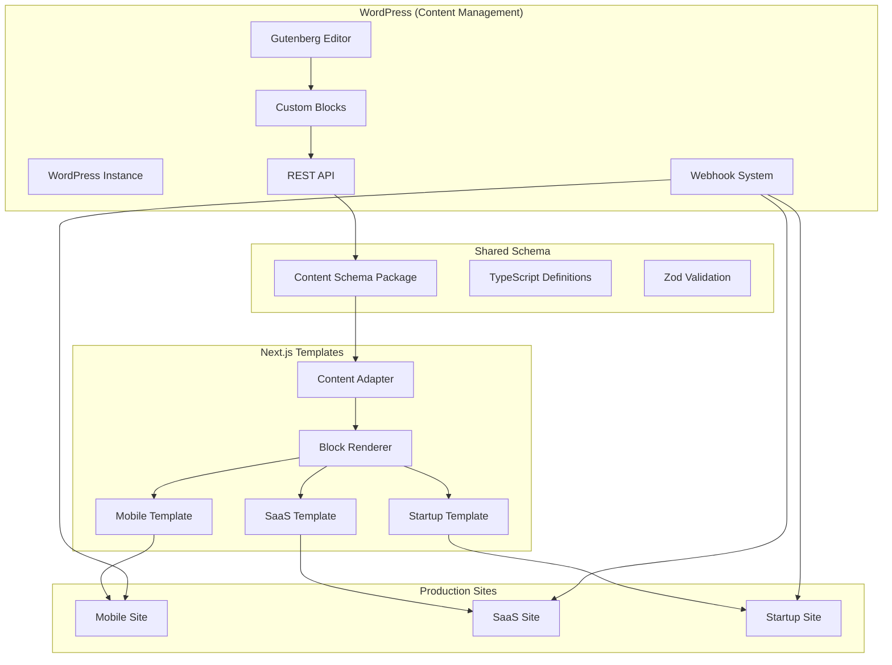

# WordPress Visual Editor System Overview

## 🎯 System Architecture

The WordPress Visual Editor system creates a seamless bridge between WordPress's familiar editing interface and Next.js's high-performance rendering, allowing content editors to visually compose pages while preserving all animations, optimizations, and code enhancements.



## 🏗️ Component Architecture

### 1. Content Schema Package (`packages/content-schema/`)

**Purpose:** Shared TypeScript definitions ensuring type safety across WordPress and Next.js

**Key Files:**
- `src/blocks.ts` - Block type definitions and interfaces
- `src/validation.ts` - Zod schemas for runtime validation
- `src/index.ts` - Exported types and validators

**Block Types Defined:**
```typescript
type BlockType = 
  | "hero" | "feature-scroll" | "feature-grid" 
  | "feature-highlight" | "bento-grid" | "benefits"
  | "testimonials" | "pricing" | "faq" | "cta" | "footer"
```

### 2. WordPress Plugin (`wordpress-plugin/next-wp-blocks/`)

**Purpose:** Custom Gutenberg blocks and REST API endpoints

**Key Components:**
- **Block Registration:** Maps each block type to Gutenberg
- **REST Controllers:** API endpoints for page management
- **Webhook System:** Real-time updates to Next.js
- **Custom Post Type:** Page composition storage

**API Endpoints:**
```
GET    /wp-json/next-wp/v1/pages           # List all pages
GET    /wp-json/next-wp/v1/pages/{slug}   # Get page by slug
POST   /wp-json/next-wp/v1/pages          # Create new page
PUT    /wp-json/next-wp/v1/pages/{slug}   # Update page
DELETE /wp-json/next-wp/v1/pages/{slug}   # Delete page
```

### 3. Next.js Integration

**Content Fetcher (`lib/content/fetcher.ts`):**
- Fetches page data from WordPress REST API
- Validates data using Zod schemas
- Implements ISR caching with 60-second revalidation
- Provides fallback data for offline scenarios

**Content Adapter (`lib/content/adapter.ts`):**
- Transforms WordPress block data into React component props
- Maps icon names to actual icon components
- Handles media item processing
- Maintains type safety throughout transformation

**Block Registry (`components/blocks/registry.tsx`):**
- Dynamic component mapping for block types
- Code splitting with Next.js dynamic imports
- Centralized block rendering logic
- Error boundary integration

## 🔄 Data Flow

### 1. Content Creation Flow

```
Editor creates page in WordPress
         ↓
Gutenberg saves block composition as JSON
         ↓
WordPress stores in custom post type
         ↓
Editor publishes page
         ↓
Webhook triggers Next.js revalidation
         ↓
Next.js fetches updated content
         ↓
Content adapter transforms data
         ↓
React components render with animations
```

### 2. Real-time Updates

```
WordPress content change
         ↓
Plugin detects publish/update
         ↓
Webhook sent with HMAC signature
         ↓
Next.js validates signature
         ↓
ISR revalidation triggered
         ↓
Specific cache tags invalidated
         ↓
Fresh content served to users
```

## 🧩 Block System

### Block Structure

Each block follows a consistent pattern:

```typescript
interface Block {
  id: string;                    // Unique identifier
  type: BlockType;              // Block type enum
  enabled?: boolean;            // Visibility toggle
  data: BlockSpecificData;      // Type-specific content
  customCss?: string;           // Optional styling
  customClasses?: string[];     // CSS classes
}
```

### Block Rendering Pipeline

1. **WordPress Storage:** Blocks stored as JSON in post meta
2. **API Retrieval:** REST API returns structured block data
3. **Validation:** Zod schemas validate data integrity
4. **Adaptation:** Adapter transforms to component props
5. **Rendering:** React components render with preserved animations

### Available Blocks

| Block Type | Purpose | Key Features |
|------------|---------|--------------|
| **Hero** | Page headers | CTAs, background images, parallax |
| **Feature Grid** | Feature listings | Icons, multi-column layouts |
| **Feature Highlight** | Detailed features | Alternating layouts, images |
| **Feature Scroll** | Product showcase | Parallax scrolling, multiple images |
| **Bento Grid** | Content showcase | Masonry layout, mixed sizes |
| **Benefits** | Customer benefits | Carousel, auto-play |
| **Testimonials** | Social proof | Multiple layouts, ratings |
| **Pricing** | Pricing tables | Yearly toggle, feature comparison |
| **FAQ** | Q&A sections | Search, accordion interface |
| **CTA** | Call-to-actions | Background options, marquee |
| **Footer** | Site footer | Links, social media, branding |

## 🔧 Technical Implementation

### Type Safety

**End-to-End TypeScript:**
```typescript
// WordPress block data
interface HeroBlockData {
  title: string;
  description: string;
  primaryCta: LinkItem;
  // ... other properties
}

// React component props
interface HeroProps {
  data: HeroBlockData;
  id?: string;
  className?: string;
}

// Validation schema
const HeroBlockDataSchema = z.object({
  title: z.string(),
  description: z.string(),
  primaryCta: LinkItemSchema,
  // ... other validations
});
```

### Animation Preservation

**Framer Motion Integration:**
```typescript
// Original animations preserved
<motion.div
  initial={{ opacity: 0, y: 20 }}
  animate={{ opacity: 1, y: 0 }}
  transition={{ duration: 0.6, ease: easeInOutCubic }}
>
  {/* WordPress content rendered here */}
</motion.div>
```

### Performance Optimization

**ISR Caching Strategy:**
```typescript
// Intelligent cache tags
{
  next: {
    tags: ["wordpress", "pages", `page-${slug}`],
    revalidate: 60, // 1 minute default
  }
}

// Webhook-triggered revalidation
revalidateTag(`page-${slug}`);
revalidatePath(`/${slug}`);
```

## 🔐 Security & Validation

### Data Validation

**Multi-layer Validation:**
1. **WordPress:** Plugin validates block data on save
2. **API:** REST API validates requests/responses
3. **Next.js:** Zod schemas validate fetched data
4. **Runtime:** Error boundaries catch rendering issues

### Webhook Security

**HMAC Signature Verification:**
```typescript
const signature = request.headers.get("x-next-wp-signature");
const expectedSignature = `sha256=${crypto
  .createHmac("sha256", webhookSecret)
  .update(body)
  .digest("hex")}`;

if (signature !== expectedSignature) {
  return new Response("Invalid signature", { status: 401 });
}
```

## 📊 Performance Characteristics

### Caching Strategy

**Multi-level Caching:**
- **WordPress:** Object caching for API responses
- **CDN:** Static asset caching
- **Next.js ISR:** Intelligent page caching
- **Browser:** Client-side caching

### Optimization Features

**Automatic Optimizations:**
- Image optimization via Next.js Image component
- Code splitting for block components
- Lazy loading for non-critical content
- Preloading for critical resources

### Performance Metrics

**Typical Performance:**
- **First Contentful Paint:** < 1.5s
- **Largest Contentful Paint:** < 2.5s
- **Cumulative Layout Shift:** < 0.1
- **Time to Interactive:** < 3s

## 🎯 Use Cases

### Content Editor Workflow

1. **Page Creation:**
   - Login to WordPress admin
   - Create new Next.js page
   - Choose template type
   - Add and configure blocks
   - Preview in real-time
   - Publish when ready

2. **Content Updates:**
   - Edit existing pages
   - Modify block content
   - Rearrange block order
   - Update images/media
   - Changes reflect immediately

### Developer Workflow

1. **New Block Development:**
   - Define block schema in content-schema package
   - Create React component
   - Register in WordPress plugin
   - Update block registry
   - Test end-to-end

2. **Template Customization:**
   - Modify existing block components
   - Add custom styling
   - Implement new animations
   - Maintain type safety

## 🚀 Deployment Architecture

### Production Setup

```
WordPress Instance (Editor)
         ↓ (REST API)
Next.js Templates (3 sites)
         ↓ (Webhooks)
Hosting Platform (Vercel/Netlify)
         ↓ (CDN)
End Users
```

### Environment Configuration

**WordPress Environment:**
- Plugin installed and activated
- Webhook URLs configured
- Secure secrets set
- REST API enabled

**Next.js Environment:**
```bash
NEXT_PUBLIC_WORDPRESS_URL=https://wp.example.com
NEXT_PUBLIC_APP_URL=https://app.example.com
WORDPRESS_WEBHOOK_SECRET=secure-secret-key
```

## 🔮 Future Enhancements

### Planned Features

1. **Advanced Block Types:**
   - Video blocks with autoplay
   - Interactive form blocks
   - Chart/graph blocks
   - Timeline blocks

2. **Enhanced Editor Experience:**
   - Live preview in WordPress
   - Block templates/patterns
   - Bulk content operations
   - Advanced media management

3. **Performance Improvements:**
   - Edge caching optimization
   - Predictive prefetching
   - Advanced image optimization
   - Bundle size reduction

4. **Developer Experience:**
   - CLI tools for block generation
   - Enhanced debugging tools
   - Performance monitoring
   - Automated testing suite

---

This system represents a complete solution for visual content editing while maintaining the performance and developer experience benefits of Next.js. The architecture ensures scalability, maintainability, and extensibility for future growth.
